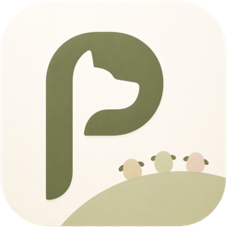

<div align="center">

#  Pastura

*AIgazing. Like stargazing, but for local LLMs.*  
Running local LLM multi-agent simulations on-device.

[](https://apps.apple.com/app/pastura-local-llms-simulator/id6788409688)

[](https://github.com/tyabu12/pastura/actions/workflows/ci.yml)
[](https://github.com/tyabu12/pastura/actions/workflows/ci.yml)
[](LICENSE)
<!-- Platform badge unversioned per ADR-004 (multi-platform). Do not add iOS 17+. -->
[](#prerequisites)

</div>

## What is Pastura

Pastura is a closed pasture for AI agents on your device. Watch as the agents act out the scenarios you've written.

You write a YAML scenario (or build it in the visual editor), pick a
local LLM, and watch the agents talk, vote, and score themselves.
Nothing leaves the device.

For the product story, design philosophy, and FAQ, head to
[pastura.app](https://pastura.app) instead.

## Architecture

The app is split into five layers.

```
Views → App / ViewModel → Engine + Data → LLM → Models
```

- **Models** has no dependencies and holds the YAML and domain types.
- **Engine** consumes **LLM** and **Models** only. It never imports
  **Data**.
- **Data** persists turn records into SQLite via GRDB.
- **LLM** abstracts the inference backend behind `LLMService`.
- **Views** and **App** are SwiftUI.

The full layer diagram and rationale live in
[`docs/decisions/ADR-001.md`](docs/decisions/ADR-001.md). The strict
dependency direction is preparation for a future SPM module split.

## Tech stack

### Language and platform

- Swift 6.x
- SwiftUI
- iOS 18.0 minimum deployment target

### Libraries

- [Yams](https://github.com/jpsim/Yams) 6.2.2 for YAML parsing
- [GRDB](https://github.com/groue/GRDB.swift) 7.11.1 for SQLite

### LLM backends

*Selected per build configuration.*

- **`LlamaCppService`** via [llama.swift](https://github.com/mattt/llama.swift). On-device llama.cpp with Metal GPU. The shipping backend for Release builds.
- **LiteRT-LM iOS SDK**. Planned target backend, blocked on Google's Swift SDK + GPU support. See [ADR-002](docs/decisions/ADR-002.md).
- **`OllamaService`** via OpenAI-compatible API. Used in Debug builds and on the Simulator.
- **`MockLLMService`**. Deterministic stub for unit tests only.

## Supported LLM models

Bundled in
[`Pastura/Pastura/App/ModelRegistry.swift`](Pastura/Pastura/App/ModelRegistry.swift).
All are GGUF quants. One is downloaded at first launch from the in-app
picker; the rest on demand from Settings → Models. Listed in catalog order,
which is the order both of those surfaces show — but not every row is offered
to a fresh install, see the note under the table.

| Model                                                                | Vendor  | Size    | Notes                                                       |
|----------------------------------------------------------------------|---------|---------|-------------------------------------------------------------|
| [Gemma 4 E2B (QAT)](https://huggingface.co/unsloth/gemma-4-E2B-it-qat-GGUF) | Google | ~2.6 GB | Default. Quantization-aware-trained build of the same Gemma, in a smaller download. |
| [Qwen 3 4B](https://huggingface.co/Qwen/Qwen3-4B-GGUF)               | Alibaba | ~2.5 GB | A different model family from Gemma — a second character to compare against. Runs with thinking mode off (`/no_think`), so no reasoning-mode framing applies. |
| [Gemma 4 E2B](https://huggingface.co/unsloth/gemma-4-E2B-it-GGUF)    | Google  | ~3.1 GB | Existing installs only — replaced by the QAT build above, and shown only if already downloaded (or currently active). |

The last row is **kept, not retired**. It stays in `ModelRegistry.catalog` so
that anyone who already downloaded it keeps their model, their row, and a way
back; `ModelManager.visibleCatalog` hides it from the picker, Settings →
Models and the home-screen model chip once it is **both** absent from the device
**and** not the active model. That second condition is deliberate — it keeps the
row reachable if the file is ever found corrupt while in use, which the app
reports as "not downloaded". See `ModelRegistry` § "ADD-and-keep" for when to
choose that shape over removing the old entry outright.

Add more by appending a `ModelDescriptor` to `ModelRegistry.catalog`.
The descriptor pins download URL, file size, and SHA-256 at compile
time. The trade-offs are documented in
[ADR-002](docs/decisions/ADR-002.md).

## Prerequisites

- Swift 6 (Xcode that supports it; CI runs on `macos-26`)
- iOS 18.0 deployment target
- iPhone with ~8 GB RAM for on-device LLM testing. `ModelRegistry.swift`
  declares a 6.5 GB `minRAM` floor; in practice that's iPhone 15 Pro,
  the iPhone 16 family (including 16e), or newer.
- [Ollama](https://ollama.com) (optional) if you want non-mock LLM
  inference in Debug or on the Simulator
- [ffmpeg](https://ffmpeg.org) and `jq` (optional) for the local
  design-review tooling: `scripts/motion-capture.sh` (animation filmstrips)
  needs ffmpeg, `scripts/ui-tour.sh` (screenshot tour) needs jq —
  `brew install ffmpeg jq`

## Build and run

Open the project in Xcode and Run.

```bash
open Pastura/Pastura.xcodeproj
```

From the command line:

```bash
# Test
scripts/xcodebuild.sh test

# Build only (no tests)
scripts/xcodebuild.sh build

# Narrow to a single suite during TDD
scripts/xcodebuild.sh test -only-testing PasturaTests/SimulationRunnerTests
```

The wrapper takes care of simulator selection, derived-data paths, and
the localization-catalog sync step. See
[`.claude/rules/xcodebuild-cli.md`](.claude/rules/xcodebuild-cli.md) for
the full playbook.

## Project layout

```
pastura/
├── Pastura/
│   ├── Pastura/             # iOS app source
│   │   ├── PasturaApp.swift
│   │   ├── App/             # App state, navigation, ViewModels
│   │   ├── Engine/          # Scenario engine (phases, scoring)
│   │   ├── LLM/             # Inference backends (llama.cpp, Ollama, Mock)
│   │   ├── Data/            # GRDB / SQLite persistence
│   │   ├── Models/          # Domain types, depends on nothing
│   │   ├── Views/           # SwiftUI screens and components
│   │   ├── Utilities/
│   │   └── Resources/       # Presets, demo replays, blocklist, .xcstrings catalogs
│   ├── PasturaTests/        # Unit and integration tests
│   └── PasturaUITests/      # UI tests
├── tools/
│   ├── harness/             # pastura-harness — headless macOS simulation runner (ADR-013)
│   └── kmp-gate-spike/      # ADR-023 Stage-2 gate spike consumer (builds nightly only)
├── shared/                  # KMP shared modules (ADR-023)
│   ├── models/              # Mirrors Swift Models/; landed as infra, not production-wired
│   └── engine/              # Engine port — Stage-2 gate slice landed, bulk port gated
├── docs/
│   ├── ROADMAP.md           # Phase scope and Go / No-Go criteria
│   ├── release-setup.md     # TestFlight bootstrap — per-machine + account setup
│   ├── decisions/           # Architecture Decision Records
│   ├── specs/               # Feature specifications
│   ├── design/              # Design system, reference assets
│   ├── i18n/                # Localization workflow
│   ├── blocklist/           # ContentBlocklist source + build script
│   ├── gallery/             # Shared-scenario gallery (gallery.json + YAMLs)
│   ├── examples/            # Reference scenario YAMLs, not bundled as presets
│   ├── prototype/           # Python reference implementation
│   ├── models/              # LLM model onboarding procedure
│   ├── measurements/        # Measurement protocols (grammar-sampling baseline)
│   ├── ci/                  # CI flake catalog and recovery walkthroughs
│   ├── qa/                  # Manual QA walkthroughs
│   ├── code-health/         # code-health-audit ledger and digests
│   ├── security/            # Operator security checklist
│   ├── store/               # App Store listing copy, review notes, screenshot plan
│   └── phase0/              # Phase 0 assessment (historical)
├── web/                     # The pastura.app site (Astro SSG, deployed via GitHub Pages)
├── scripts/                 # Build, lint, release, content-blocklist helpers
├── fastlane/                # TestFlight release lanes (ADR-014); Gemfile / Gemfile.lock pin it
├── .github/                 # CI workflows and issue templates
├── .claude/                 # Agent definitions, rules, skills, hook config
├── Package.swift            # pastura-harness manifest (+ Package.resolved) — compiles app core for macOS
└── build.gradle.kts         # Gradle root for shared/ (settings.gradle.kts, gradle/, gradlew*)
```

Root-level docs (this file, `CLAUDE.md`, `CONTRIBUTING.md`, `LICENSE`) and
config dotfiles (`.swiftlint.yml`, `.swift-format`, `.gitignore`) are omitted
above; every other tracked root entry is listed.

## Documentation

- [`docs/ROADMAP.md`](docs/ROADMAP.md) for phase status and what ships
  next.
- [`docs/decisions/`](docs/decisions/) for Architecture Decision Records.
- [`docs/specs/`](docs/specs/) for MVP and feature specifications.
- [`docs/design/design-system.md`](docs/design/design-system.md) for
  design tokens, components, and philosophy.
- [`CLAUDE.md`](CLAUDE.md) for hard rules, Swift conventions, and the
  context AI agents use. Humans can read it too.
- [`CONTRIBUTING.md`](CONTRIBUTING.md) for sending a PR.
- **Maintainers** — [`docs/release-setup.md`](docs/release-setup.md) for the
  one-time TestFlight release bootstrap.

## License

[MIT](LICENSE)
