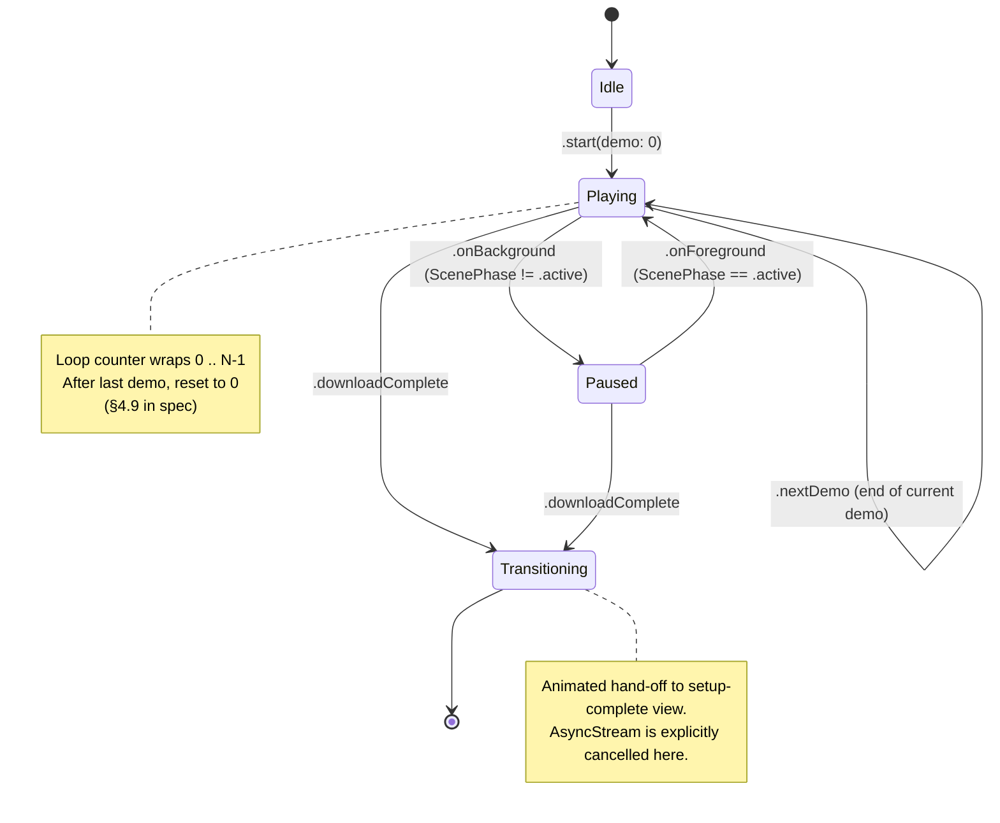

# ADR-007: DL-time Demo Replay — iOS Lifecycle and State Integration

> **Status:** Accepted
> **Date:** 2026-04-19
> **Context:** Phase 2 feature. While the Gemma 4 E2B model (~3 GB)
> downloads on first launch, the app plays back curated pre-recorded
> simulation logs so the user experiences the product instead of
> watching a progress bar. The data format, component architecture,
> and curation policy live in
> `docs/specs/demo-replay-spec.md`. This ADR owns the iOS lifecycle
> decisions: how the replay state composes with `PasturaApp.AppState`,
> FG/BG transitions, download-failure recovery, mobile-data warning,
> and DL-vs-playback timing mismatch.

---

## Summary

The DL-time demo is introduced as a **sub-state inside the existing
`.needsModelDownload` `AppState` case**, not as a new top-level
`AppState` case. This keeps `PasturaApp.swift` untouched by the feature
at the `AppState`-switch level, preserving mergeability with in-flight
work on the same file (#148 Ollama-wrap and #149 PrivacyInfo.xcprivacy,
both of which modify the init path).

Four lifecycle concerns are pinned: (1) BG transition mid-playback,
(2) DL failure + retry, (3) mobile-data warning, (4) DL-vs-playback
timing mismatch. The replay state machine (spec §4.9) is composed with
`ScenePhase` observation and `ModelManager.state` so the user always
sees the right surface for their current situation.

This ADR does **not** block App Store submission. It is a Phase 2
enhancement sequenced after [#148](https://github.com/tyabu12/pastura/issues/148)
and [#149](https://github.com/tyabu12/pastura/issues/149) close. ADR-005
§2.5 scope framing applies unchanged: submission-bound builds need
#148/#149 resolved; this ADR adds no new submission blocker.

---

## 1. Context

### 1.1 Why an ADR (and not just the spec)

The data format, VM architecture, and MVP scope are design-doc concerns
and live in `docs/specs/demo-replay-spec.md`. But three aspects of the
feature span architectural decisions that belong in the decision record:

- **`AppState` composition.** Where replay lives in the existing
  top-level state machine affects every future feature that touches
  `PasturaApp.swift` (including #148 and #149 which are in flight on
  the same file). Picking "new sub-state vs new `AppState` case" is a
  permanent decision that deserves an authoritative record.
- **Cross-ADR integration.** Demo replay interacts with ADR-003
  (background execution — model download runs in a BG task), ADR-002
  (llama.cpp provenance stored in recorded metadata), and ADR-005
  (ContentFilter applies to every display surface, including demo
  replay's). Without ADR-007, future ADR readers would need to infer
  those interactions from the spec.
- **Lifecycle fan-out.** iOS lifecycle introduces enough branching
  (BG transition, scene phase, DL failure, flaky network) that picking
  a single authoritative behaviour per case prevents implementation
  drift — especially important because the lifecycle logic is one of
  the harder-to-test parts of iOS UX.

### 1.2 Non-blocking for App Store submission

This ADR is explicitly **not** a submission blocker. The feature adds
quality to the first-launch UX; the app ships without it and review
passes. ADR-005 §9.2 lists the submission-blocking sub-issues (#148
Ollama wrap, #149 PrivacyInfo.xcprivacy); neither is affected by this
ADR.

Phase placement rationale:

- Earlier than ADR-006 Cloud API (which needs significant design +
  server work) because demo-replay leverages Phase 2 deliverables
  already in tree (Past Results Viewer pattern, AgentOutputRow).
- After #148/#149 because those touch `PasturaApp.swift` and
  `AppDependencies.swift`; sequencing demo-replay after their merge
  avoids three-way merge conflicts on the init path.
- Phase 2 (not 2.5) because the feature target is the first App Store
  release window — the DL-time UX is most valuable when the user base
  is first growing.

### 1.3 Scope

In scope for this ADR:

- `AppState` composition (new sub-state inside `.needsModelDownload`).
- iOS lifecycle behaviour for four named cases (§3).
- Relationship to ADR-002 / ADR-003 / ADR-005 (§4).
- Named sub-issue index for follow-up implementation work (§5).

Out of scope (lives in `docs/specs/demo-replay-spec.md` or downstream
sub-issues):

- YAML schema and curation policy.
- `ReplayViewModel` / `ReplaySource` component design.
- MVP preset selection and count floors.
- CI drift-guard script implementation.
- Localisation / EN demo recording.

---

## 2. Pre-decisions

The spec (`docs/specs/demo-replay-spec.md` §2) holds the full decision
table. The ADR-specific pre-decisions are:

### 2.1 AppState composition

**Replay is a sub-state of `AppState.needsModelDownload`, not a new
`AppState` case.** Concretely, `ModelDownloadView` (or a host view that
replaces it) owns the replay presentation; the outer `RootView` switch
in `PasturaApp.swift` does not learn about demo replay. Rationale in
§3.1 and §4.1.

### 2.2 Sequencing

**Implementation PR lands after both #148 and #149 merge.** Those
issues modify `PasturaApp.swift` / `AppDependencies.swift`; lapping
their work would create three-way merge conflicts on the init path. The
demo-replay implementation PR's description must reference both as
merge-dependencies.

### 2.3 Lifecycle-owner split

- **Replay state machine** (playing / looping / paused / transitioning)
  lives in `ReplayViewModel` per spec §4.9.
- **Lifecycle events** (scene-phase transitions, download state
  changes, reachability signals) are observed by the **DL-time host
  view** and forwarded to `ReplayViewModel` as method calls. The VM
  does not observe `ScenePhase` directly.
- **Animated transition on DL complete** (spec §2 decision 8) is owned
  by the host view (SwiftUI `.transition` / `matchedGeometryEffect`);
  the VM merely exposes a `shouldTransition: Bool` observable.

This split keeps the VM platform-agnostic (testable without
`UIApplication` / `ScenePhase`) and puts iOS-specific observation in
one place.

### 2.4 No new SimulationEvent cases

The replay path emits existing `SimulationEvent` cases (Models/,
already `public Sendable`). No new cases are added to the public event
contract for this feature. If replay ever needs a new event shape
(e.g. `replayMilestone`), a dedicated cross-ADR amendment is required
— this ADR does not pre-authorise it.

---

## 3. iOS Lifecycle State Machine

### 3.1 Composition with `AppState`

The existing state machine at `Pastura/Pastura/PasturaApp.swift` has
four cases: `.initializing`, `.needsModelDownload`, `.ready(...)`,
`.error(...)`. Demo replay lives **entirely inside**
`.needsModelDownload`:

```
AppState.needsModelDownload
  │
  └── DemoReplayHostView           ← new, replaces ModelDownloadView for users
      │                              who are eligible for the demo (§3.5)
      ├── ReplayViewModel           ← spec §4.2
      │    └─ state: .idle | .playing | .paused | .transitioning
      ├── ModelDownloadView bits     ← progress bar + static copy slots
      │    (slots A/B/C from spec §5.4)
      └── ScenePhase observer       ← forwards BG/FG changes to VM (§3.3)
```

`DemoReplayHostView` replaces `ModelDownloadView` as the view
presented by `RootView` inside the `.needsModelDownload` branch —
unchanged from an outer-`AppState` perspective:

```swift
case .needsModelDownload:
  DemoReplayHostView(modelManager: modelManager)   // was: ModelDownloadView
    .onChange(of: modelManager.state) { _, newState in
      if case .ready(let modelPath) = newState {
        Task { await finalizeInit(modelPath: modelPath) }
      }
    }
```

The `.onChange` observer and the `.ready → finalizeInit` wiring are
unchanged; only the presented view type changes. This is load-bearing
for #148/#149 sequencing (§2.2) — both issues touch the same init
path, and a no-diff change to the `case .needsModelDownload:` body
minimises merge conflict surface.

### 3.2 Replay state machine (Mermaid)



The VM exposes these states as an `@Observable` `@MainActor`-bound
property; the host view and SwiftUI `.transition` modifiers key
against state identity rather than internal VM flags.

### 3.3 Four lifecycle cases

| Case | Trigger | Behaviour | Owner |
|------|---------|-----------|-------|
| **(a) BG transition mid-playback** | `ScenePhase` drops below `.active` (app backgrounded, scene hidden, control center overlay) | Host view calls `ReplayViewModel.onBackground()`. VM cancels its outstanding `Task.sleep`, transitions to `.paused(demoIndex, turnCursor)`. On `.active` return, host calls `onForeground()` → VM resumes with a fresh `Task.sleep` using the remaining delay for the current turn. DL task (BGContinuedProcessingTask per ADR-003) continues independently. | Host view observes `ScenePhase`; VM owns state. |
| **(b) DL failure + retry** | `ModelManager.state` transitions to `.error(...)` during playback | Replay **continues** (the replay surface is ambient value-demonstration; interrupting it to show the error punishes the user for an infrastructure problem). Progress bar area switches to an inline retry affordance: error message + "もう一度試す" button. On retry success, progress bar resumes from where it left off. | `ModelManager` is the source of truth; host view renders the current error state in the progress bar area. VM state is untouched. |
| **(c) Mobile-data warning** | Initial download attempt on cellular (per `NSURLSessionConfiguration.allowsCellularAccess` observation) | **Shown before replay starts** — a one-time mobile-data confirmation modal precedes the DL host view. If user declines, the app reverts to a no-DL screen (Wi-Fi advisory). Replay does not start while the modal is visible. If user accepts, the modal dismisses and replay begins alongside the DL. | Host view presents the modal; `ModelManager` respects the confirmation state. VM is not involved until after confirmation. |
| **(d) DL faster than demo (timing mismatch)** | `ModelManager.state` transitions to `.ready(...)` while VM is in any `.playing`/`.paused` state | Host view forwards `downloadComplete` to the VM → VM transitions to `.transitioning`. The animated hand-off (owned by host view) plays for a short duration (~400-800 ms, final value in impl PR), after which `finalizeInit` runs and the outer `AppState` moves to `.ready(deps)`. Replay playback stops immediately at `.transitioning` entry; the current turn is not finished. | Host view owns the animation; VM transitions state. `RootView` / `AppState` unchanged. |

Inverse of (d) — **DL slower than whole demo set** — is handled by the
loop behaviour (spec §4.9): demos cycle until `downloadComplete`
arrives, with no stop condition based on elapsed time.

### 3.4 AsyncStream cancellation and resume semantics

`ReplaySource.events()` returns an `AsyncStream<SimulationEvent>` whose
per-event delays are driven by `Task.sleep` inside the source
(conceptually — the exact sleep home is an implementation detail). The
stream is:

- **Cancelled on `.transitioning` entry.** The host view unmounts the
  VM; cancellation propagates through to the source's producer task.
- **Cancelled on `.paused` entry** for the *current* delay only. The
  VM stores `turnCursor` and `remainingDelayMs`; on resume, a new
  `Task.sleep(for: remainingDelayMs / speedMultiplier)` fires before
  the next event is pulled. This is the resume-from-position contract
  spec §4.9 names.
- **Cancelled and rebuilt on `.nextDemo`.** Each demo's event stream is
  independent; advancing to the next demo cancels the current stream
  cleanly and constructs a fresh one from the next `ReplaySource`.

### 3.5 Eligibility for demo mode

Not every `.needsModelDownload` entry shows the demo. The host view
short-circuits to the plain progress-bar UX when:

- Zero demos pass validation (spec §5.3 fallback).
- The user is in the mobile-data confirmation flow (case (c)) — demo
  starts only after confirmation.
- Accessibility: if `UIAccessibility.isReduceMotionEnabled` is true,
  animated transitions in demo playback are disabled; replay still
  plays but without motion transitions. (This is a lightweight
  accommodation; full accessibility pass is tracked as a follow-up.)

### 3.6 Sequencing note

Implementation PR must merge **after** both [#148](https://github.com/tyabu12/pastura/issues/148)
and [#149](https://github.com/tyabu12/pastura/issues/149). Both touch
`PasturaApp.swift` / `AppDependencies.swift` on the init path; landing
demo-replay before they do creates a three-way merge on a file that is
already sensitive to edits.

The implementation PR description must explicitly list both as
merge-dependencies and confirm the sequencing in the opening bullets.

---

## 4. Integration with Other ADRs

*(Section stub — filled in subsequent commit.)*

---

## 5. Consequences, Sub-issue Master Index, References

*(Section stub — filled in subsequent commit.)*
