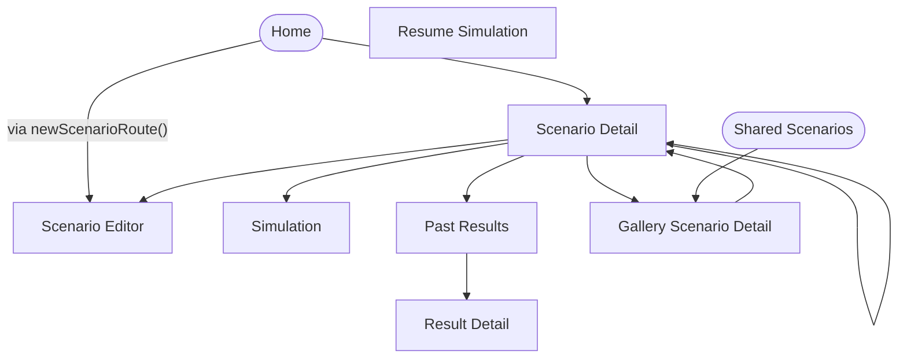

<!-- Generated by scripts/generate-navigation-map.py — DO NOT edit by hand.
     Regenerate: python3 scripts/generate-navigation-map.py
     Drift guard: python3 scripts/generate-navigation-map.py --check (CI: navigation-map-drift) -->

# Navigation Map — per-tab NavigationStacks

Screen graph of the four per-tab stacks, generated from `Route` enum
cases and `NavigationLink` / `router.push` / `pushIfOnTop` callsites.
Sheets and fullScreenCover flows are out of scope (each `AppRouter`
manages its tab's stack only — see `.claude/rules/navigation.md`).
`home` (`HomeView`) and `sharedScenarios` (`SharedScenariosListView`,
the Browse tab root) are tab-stack roots, not `Route` cases.

## Screenshot tour

The `ScreenshotTourTests` UI test
(`Pastura/PasturaUITests/ScreenshotTourTests.swift`) is the single
source of truth for what the tour captures, in order — including
tab-reached screens (e.g. Settings) that are not `Route` graph nodes
above. `scripts/ui-tour.sh` runs it and extracts the PNGs into
`docs/design/screenshots/` (gitignored — regenerate to view;
`docs/design/screenshots/README.md`). Anchors are the per-screen wait
identifiers; *Reached via* is the launch root, a tab switch, or a
tab-stack push.

| # | Screenshot | Tour anchor | Reached via |
|---|------------|-------------|-------------|
| 1 | `01-home.png` | `home.scenarioListCell.ui_test_home_seed` | root |
| 2 | `02-scenario-detail.png` | `scenarioDetail.list` | push |
| 3 | `03-editor.png` | `editor.titleField` | push |
| 4 | `04-shared-scenarios.png` | `sharedScenarios.galleryCell.ui_test_canary` | tab |
| 5 | `05-gallery-detail.png` | `galleryDetail.tryButton` | push |
| 6 | `06-settings.png` | `settings.licensesLink` | tab |
| 7 | `07-results.png` | `results.list` | tab |
| 8 | `08-result-detail.png` | `resultDetail.timeline` | push |
