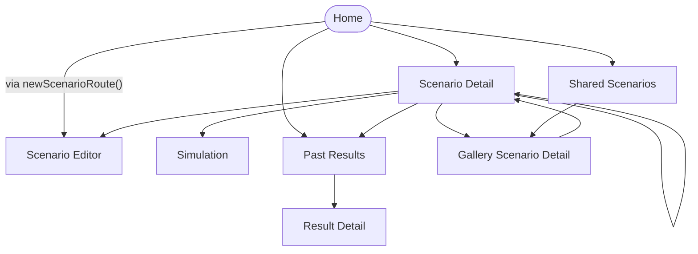

<!-- Generated by scripts/generate-navigation-map.py — DO NOT edit by hand.
     Regenerate: python3 scripts/generate-navigation-map.py
     Drift guard: python3 scripts/generate-navigation-map.py --check (CI: navigation-map-drift) -->

# Navigation Map — root NavigationStack

Screen graph of the root stack, generated from `Route` enum cases and
`NavigationLink` / `router.push` / `pushIfOnTop` callsites. Sheets and
fullScreenCover flows are out of scope (`AppRouter` manages the root
stack only — see `.claude/rules/navigation.md`). `home` is the stack
root (`HomeView`), not a `Route` case.

## Screens

Screenshot names refer to `scripts/ui-tour.sh` outputs (gitignored —
regenerate to view; `docs/design/screenshots/README.md`). Anchors are
the tour's per-screen wait identifiers.

| Node | Screen | Pushed from | Tour anchor | Screenshot |
|------|--------|-------------|-------------|------------|
| `home` | Home | — (stack root) | `home.scenarioListCell.*` | `01-home.png` |
| `scenarioDetail` | Scenario Detail | `galleryScenarioDetail`, `home`, `scenarioDetail` | `scenarioDetail.list` | `02-scenario-detail.png` |
| `editor` | Scenario Editor | `home`, `scenarioDetail` | `editor.titleField` | `03-editor.png` |
| `simulation` | Simulation | `scenarioDetail` | — | deferred — see `screenshots/README.md` |
| `results` | Past Results | `home`, `scenarioDetail` | `results.list` | `07-results.png` |
| `resultDetail` | Result Detail | `results` | `resultDetail.timeline` | `08-result-detail.png` |
| `sharedScenarios` | Shared Scenarios | `home` | `sharedScenarios.galleryCell.*` | `04-shared-scenarios.png` |
| `galleryScenarioDetail` | Gallery Scenario Detail | `scenarioDetail`, `sharedScenarios` | `galleryDetail.tryButton` | `05-gallery-detail.png` |
